# Sơ Đồ Kiến Trúc Dự Án Tin Thể Thao

## 1. Tổng Quan Hệ Thống

Sơ đồ này mô tả cách các thành phần trong hệ thống tương tác với nhau, từ việc thu thập dữ liệu đến hiển thị cho người dùng.

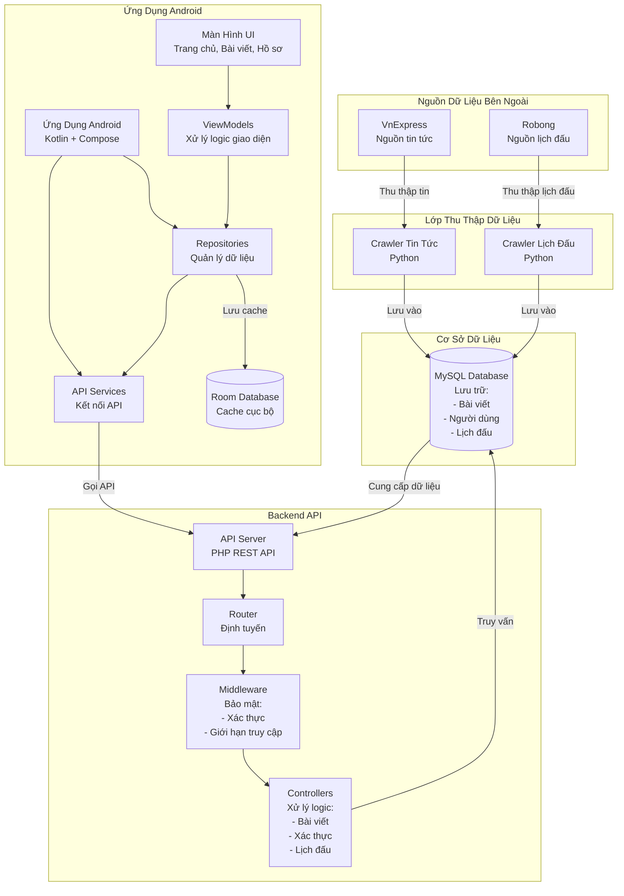

## 2. Tổng Quan Kiến Trúc Android App

Sơ đồ tổng quan về kiến trúc MVVM của ứng dụng Android.

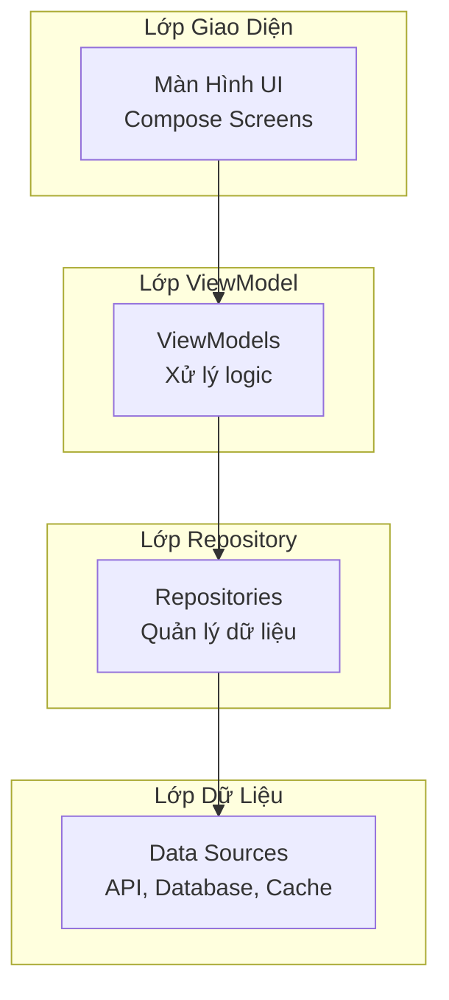

## 2.1. Chi Tiết Lớp Giao Diện (UI Layer)

### 2.1.1. Cấu Trúc Màn Hình

Sơ đồ mô tả các màn hình chính trong ứng dụng và mối quan hệ giữa chúng.

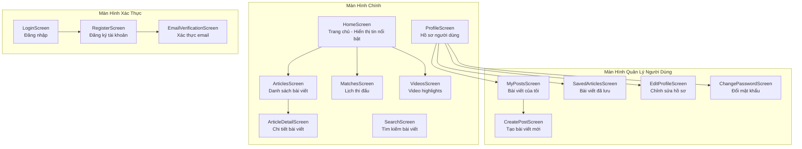

### 2.1.2. Thành Phần Giao Diện (UI Components)

Sơ đồ mô tả các thành phần giao diện có thể tái sử dụng trong ứng dụng.

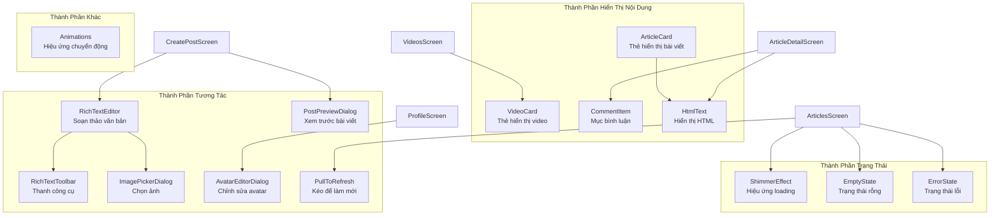

### 2.1.3. Luồng Điều Hướng Màn Hình

Sơ đồ mô tả cách người dùng điều hướng giữa các màn hình. Người dùng chưa đăng nhập vẫn có thể vào HomeScreen và xem nội dung, nhưng không thể like hoặc bình luận bài viết.

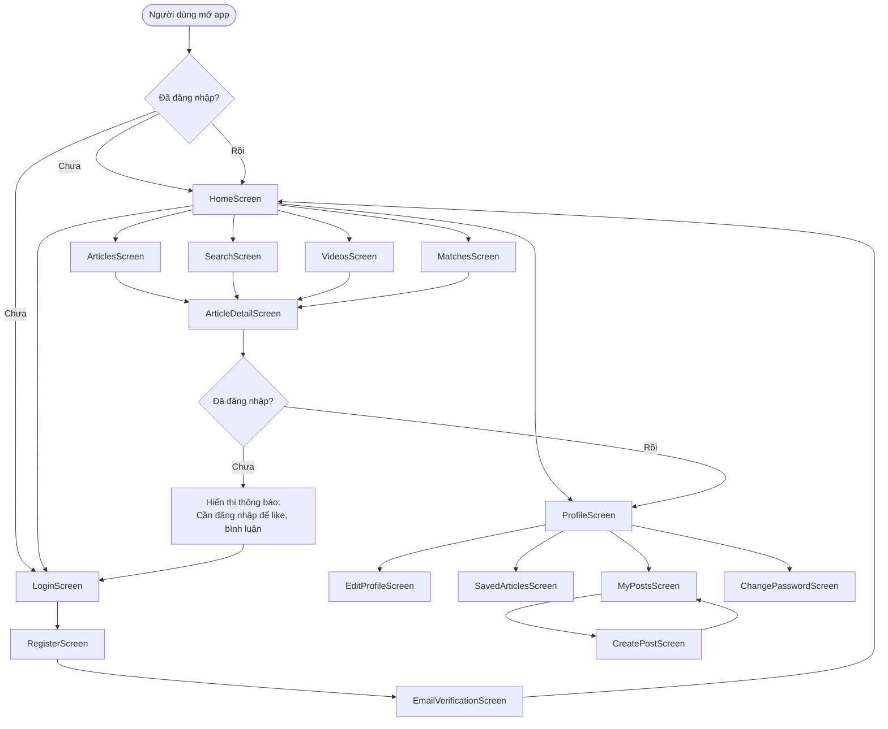

## 2.2. Chi Tiết Lớp ViewModel

### 2.2.1. Cấu Trúc ViewModel

Sơ đồ mô tả các ViewModel và mối quan hệ với Repository.

```mermaid
graph TB
    subgraph "ViewModels Màn Hình Chính"
        HomeVM["HomeViewModel<br/>Quản lý:<br/>Tin nổi bật<br/>Danh mục<br/>Lịch đấu sắp tới"]
        ArticleVM["ArticlesViewModel<br/>Quản lý:<br/>Danh sách bài viết<br/>Phân trang<br/>Lọc theo danh mục"]
        DetailVM["ArticleDetailViewModel<br/>Quản lý:<br/>Chi tiết bài viết<br/>Bình luận<br/>Lượt thích"]
        ProfileVM["ProfileViewModel<br/>Quản lý:<br/>Thông tin người dùng<br/>Avatar<br/>Cài đặt"]
        SearchVM["SearchViewModel<br/>Quản lý:<br/>Tìm kiếm<br/>Lịch sử tìm kiếm<br/>Kết quả"]
        MatchVM["MatchesViewModel<br/>Quản lý:<br/>Lịch đấu<br/>Trận đấu trực tiếp<br/>Kết quả"]
        VideoVM["VideosViewModel<br/>Quản lý:<br/>Danh sách video<br/>Video highlights<br/>Phân trang"]
    end
    
    subgraph "ViewModels Xác Thực"
        AuthVM["AuthViewModel<br/>Quản lý:<br/>Đăng nhập<br/>Đăng ký<br/>Xác thực email"]
    end
    
    subgraph "ViewModels Quản Lý Nội Dung"
        PostVM["PostViewModel<br/>Quản lý:<br/>Tạo bài viết<br/>Chỉnh sửa<br/>Upload ảnh"]
        SavedVM["SavedArticlesViewModel<br/>Quản lý:<br/>Bài viết đã lưu<br/>Xóa khỏi danh sách"]
    end
    
    subgraph "ViewModels Hệ Thống"
        ThemeVM["ThemeViewModel<br/>Quản lý:<br/>Chế độ sáng/tối<br/>Cài đặt giao diện"]
    end
    
    subgraph "Repositories"
        NewsRepo["NewsRepository"]
        ArticleRepo["ArticleRepository"]
        CommentRepo["CommentRepository"]
        UserRepo["UserRepository"]
        AuthRepo["AuthRepository"]
        PostRepo["PostRepository"]
        CategoryRepo["CategoryRepository"]
    end
    
    HomeVM --> NewsRepo
    HomeVM --> CategoryRepo
    ArticleVM --> ArticleRepo
    ArticleVM --> CategoryRepo
    DetailVM --> ArticleRepo
    DetailVM --> CommentRepo
    ProfileVM --> UserRepo
    SearchVM --> ArticleRepo
    MatchVM --> NewsRepo
    VideoVM --> NewsRepo
    AuthVM --> AuthRepo
    PostVM --> PostRepo
    SavedVM --> ArticleRepo
```

### 2.2.2. Luồng Dữ Liệu ViewModel

Sơ đồ mô tả cách ViewModel xử lý dữ liệu từ UI đến Repository.

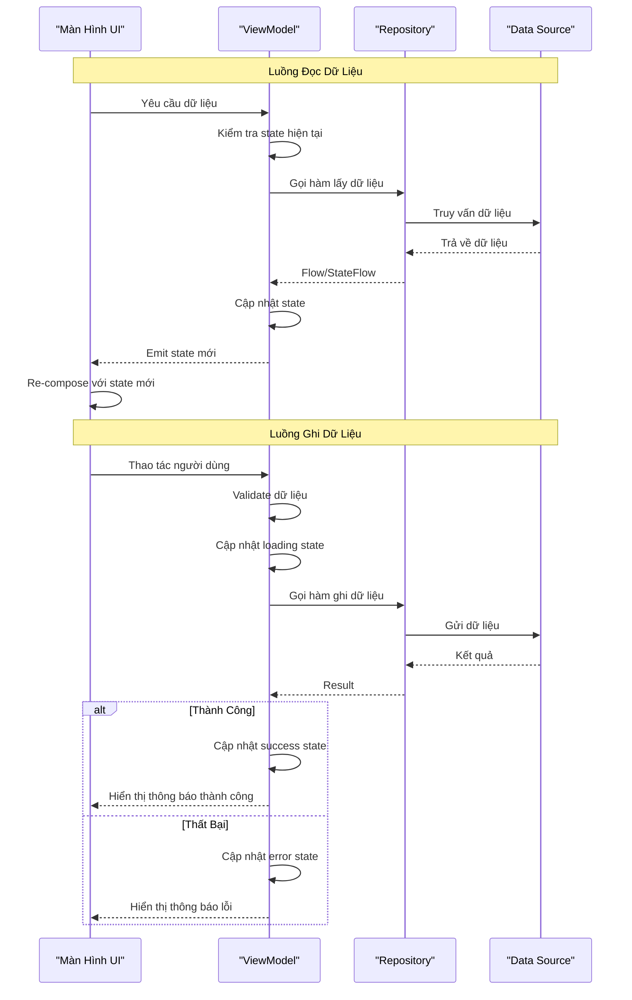

## 3. Luồng Dữ Liệu Trong Hệ Thống

Sơ đồ này mô tả cách dữ liệu di chuyển từ nguồn thu thập đến hiển thị cho người dùng.

### 3.0. Tổng Quan Luồng Dữ Liệu

Sơ đồ tổng quan mô tả hai giai đoạn chính: Thu thập dữ liệu và Người dùng sử dụng.

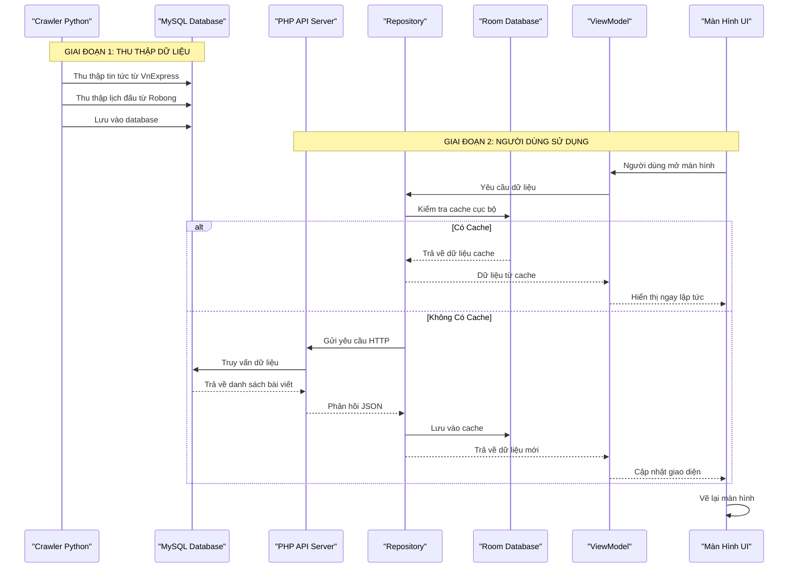

## 3.1. Chi Tiết Luồng Xử Lý Dữ Liệu

### 3.1.1. Tải Dữ Liệu Lần Đầu

Sơ đồ mô tả cách ứng dụng tải dữ liệu lần đầu khi người dùng mở màn hình.

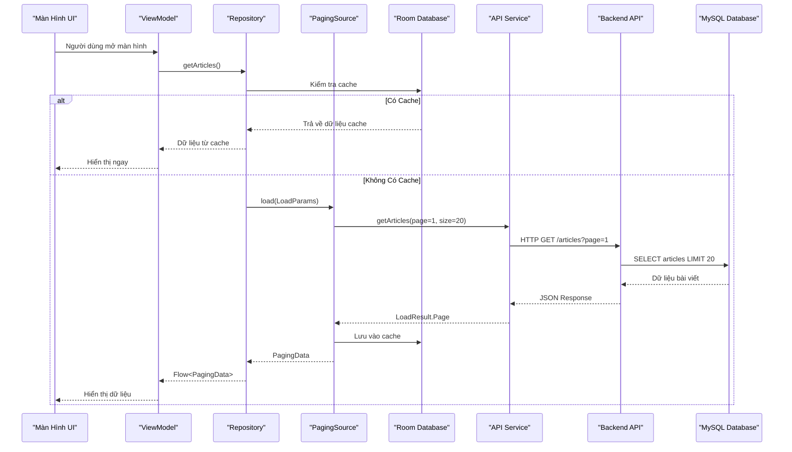

### 3.1.2. Phân Trang - Tải Thêm Dữ Liệu

Sơ đồ mô tả cách ứng dụng tự động tải thêm dữ liệu khi người dùng cuộn đến cuối danh sách.

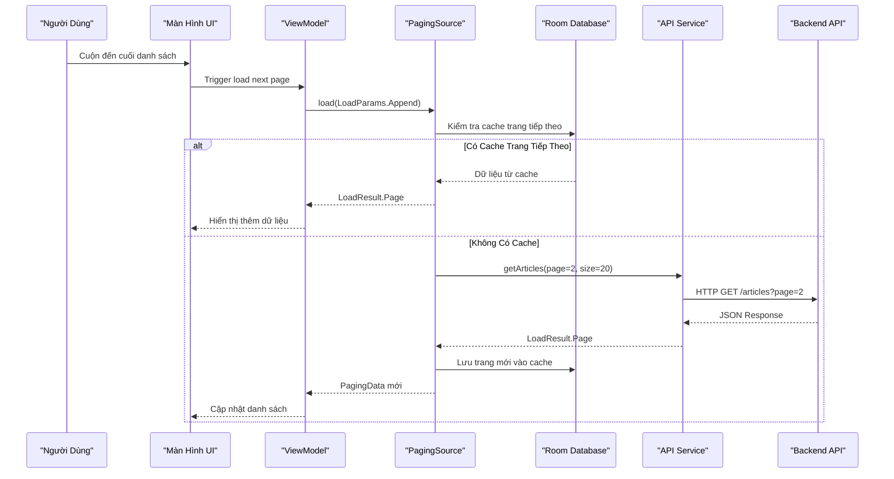

### 3.1.3. Refresh - Làm Mới Dữ Liệu

Sơ đồ mô tả cách ứng dụng làm mới dữ liệu khi người dùng kéo xuống để refresh.

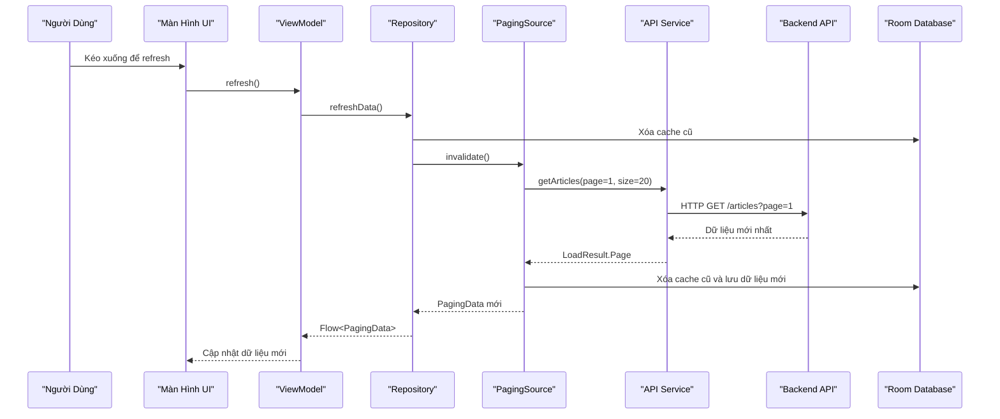

### 3.1.4. Xử Lý Lỗi và Retry

Sơ đồ mô tả cách ứng dụng xử lý lỗi mạng và cho phép người dùng thử lại.

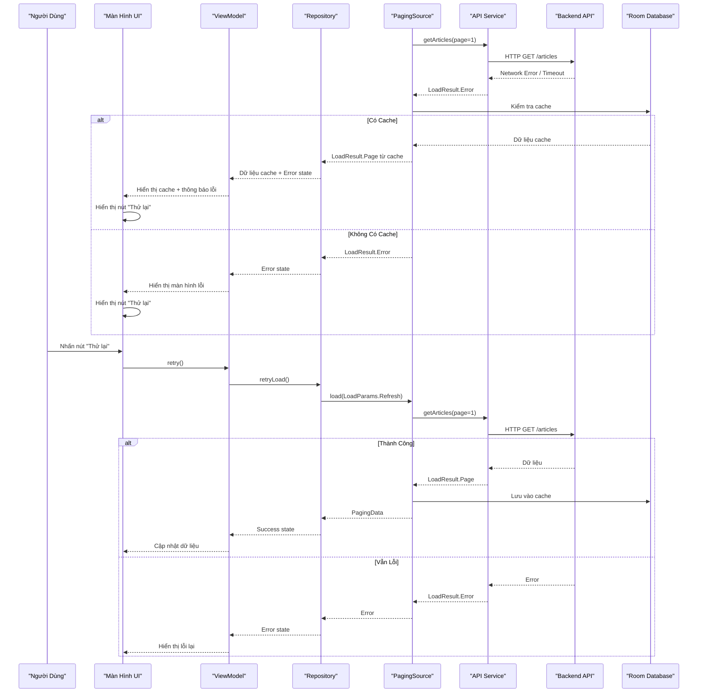

## 4. Kiến Trúc Backend API

### 4.1. Cấu Trúc Backend API

Sơ đồ mô tả cấu trúc các thành phần trong backend API.

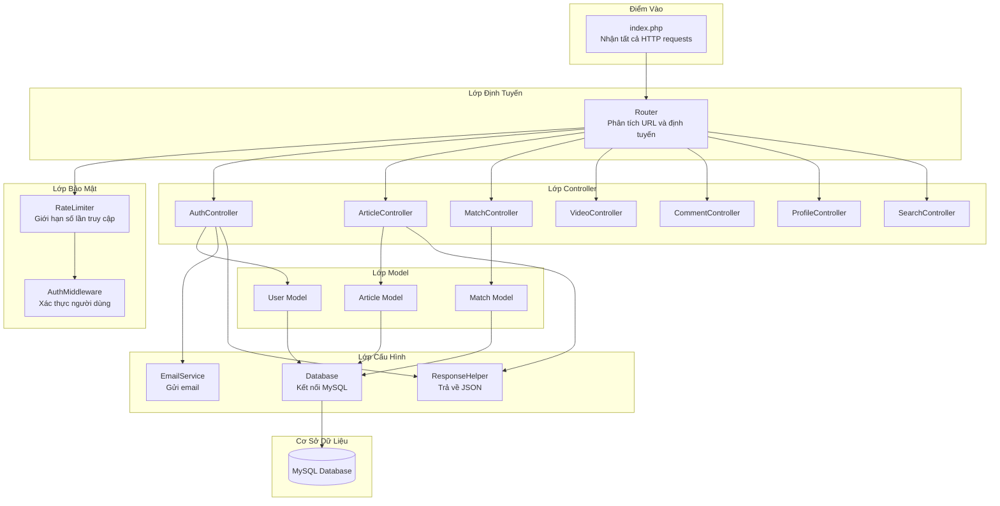

### 4.2. Luồng Xử Lý Request

Sơ đồ mô tả chi tiết cách backend xử lý một request từ Android app.

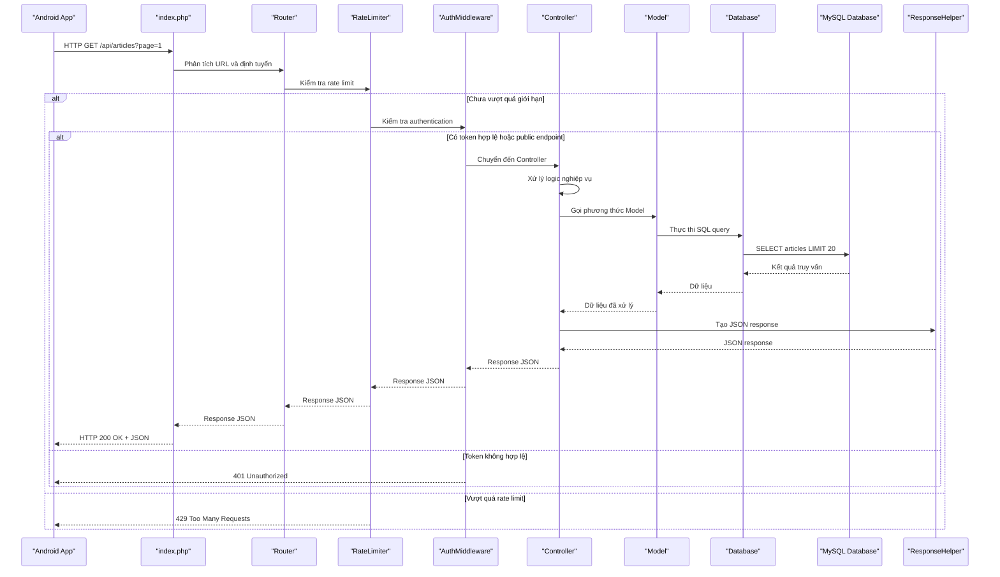

## 5. Luồng Xác Thực Người Dùng

### 5.1. Quy Trình Đăng Nhập

Sơ đồ mô tả quy trình đăng nhập của người dùng.

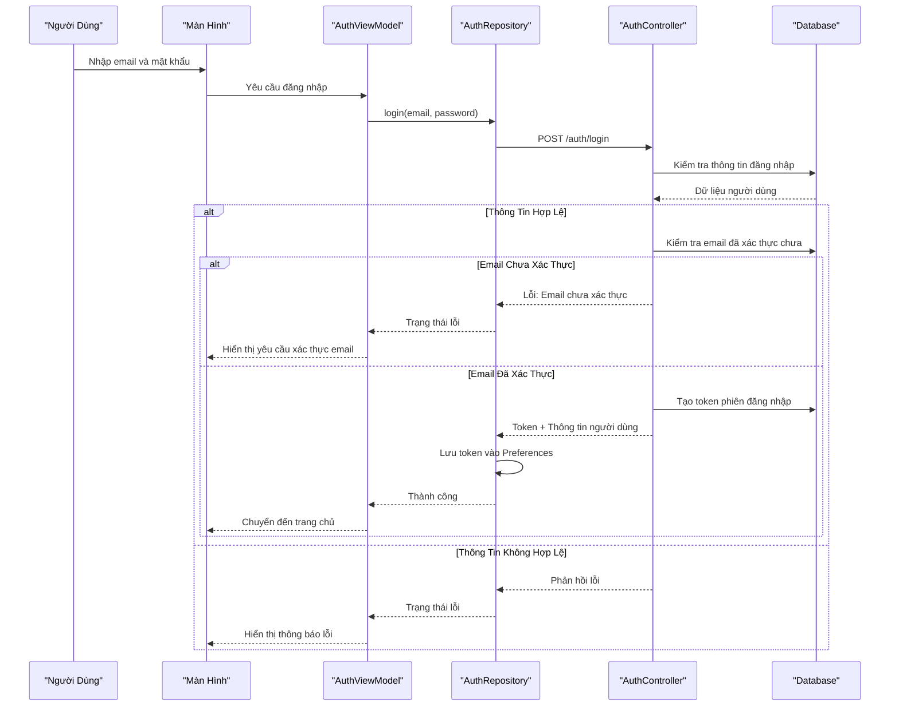

### 5.2. Quy Trình Đăng Ký

Sơ đồ mô tả quy trình đăng ký tài khoản mới của người dùng.

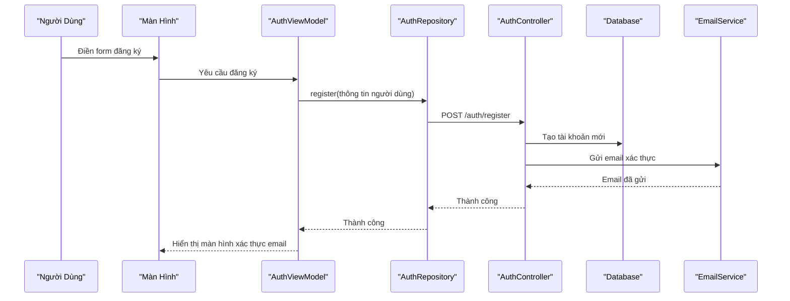

## 6. Luồng Hiển Thị Bài Viết

### 6.1. Tải Danh Sách Bài Viết

Sơ đồ mô tả cách ứng dụng tải và hiển thị danh sách bài viết.

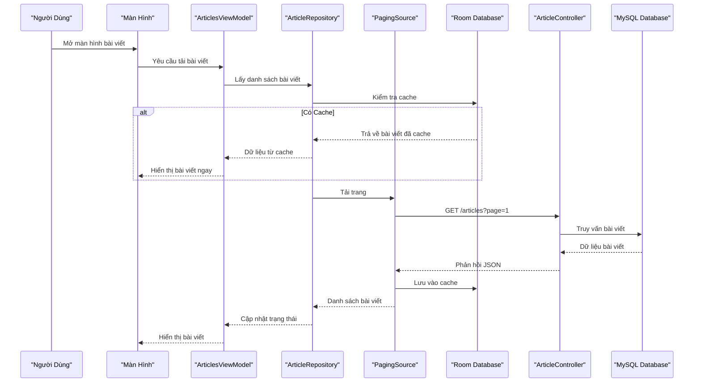

### 6.2. Xem Chi Tiết Bài Viết

Sơ đồ mô tả cách ứng dụng tải và hiển thị chi tiết một bài viết.

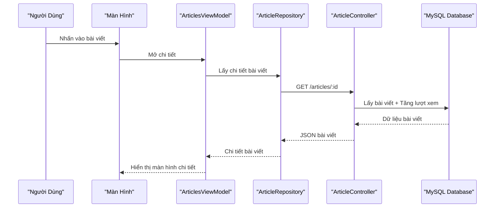

### 6.3. Thích Bài Viết

Sơ đồ mô tả cách ứng dụng xử lý thao tác thích bài viết.

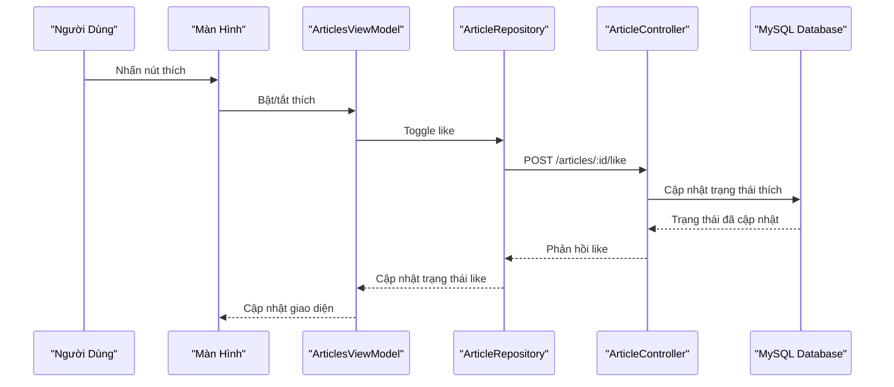

## 7. Kiến Trúc Crawler

Sơ đồ này mô tả cách crawler thu thập dữ liệu từ các nguồn bên ngoài và lưu vào database.

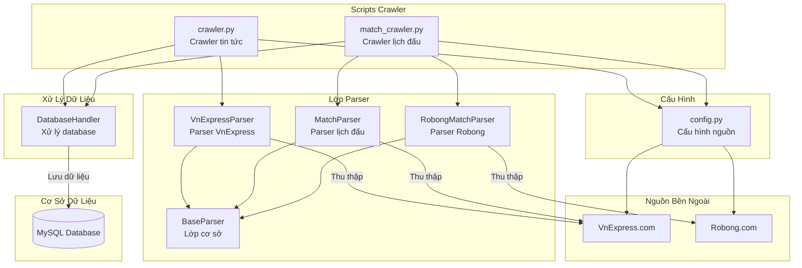

## Tóm Tắt Kiến Trúc

### Ứng Dụng Android
- **Kiến trúc**: MVVM (Model-View-ViewModel) - Tách biệt logic và giao diện
- **UI Framework**: Jetpack Compose - Xây dựng giao diện hiện đại
- **Dependency Injection**: Hilt - Quản lý phụ thuộc tự động
- **Networking**: Retrofit + OkHttp - Giao tiếp với API
- **Local Storage**: Room Database + DataStore Preferences - Lưu trữ cục bộ
- **Paging**: Android Paging 3 - Phân trang dữ liệu
- **Navigation**: Navigation Compose - Điều hướng màn hình

### Backend API
- **Framework**: Custom PHP Router - Router tự xây dựng
- **Pattern**: MVC (Model-View-Controller) - Tách biệt các lớp
- **Database**: MySQL - Cơ sở dữ liệu quan hệ
- **Authentication**: JWT Token-based - Xác thực bằng token
- **Middleware**: Auth, Rate Limiting - Bảo mật và giới hạn truy cập
- **Email**: EmailService - Gửi email xác thực

### Crawler
- **Ngôn ngữ**: Python - Ngôn ngữ lập trình
- **Pattern**: Parser Pattern với BaseParser - Mẫu thiết kế parser
- **Nguồn**: VnExpress, Robong - Các trang web nguồn
- **Lưu trữ**: MySQL Database - Lưu vào database

---